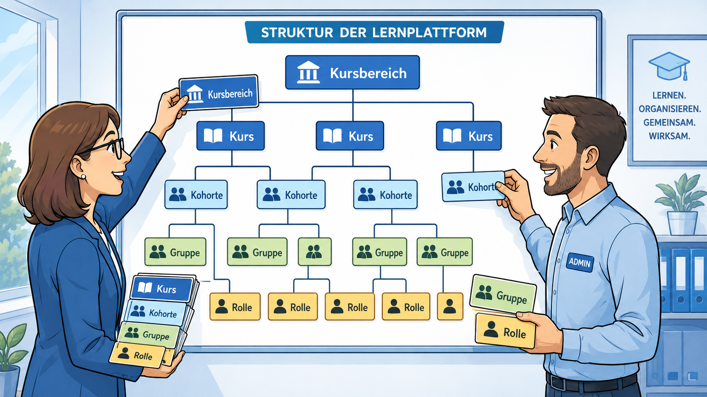
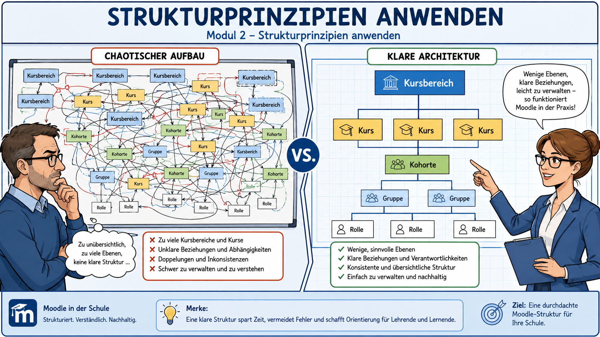
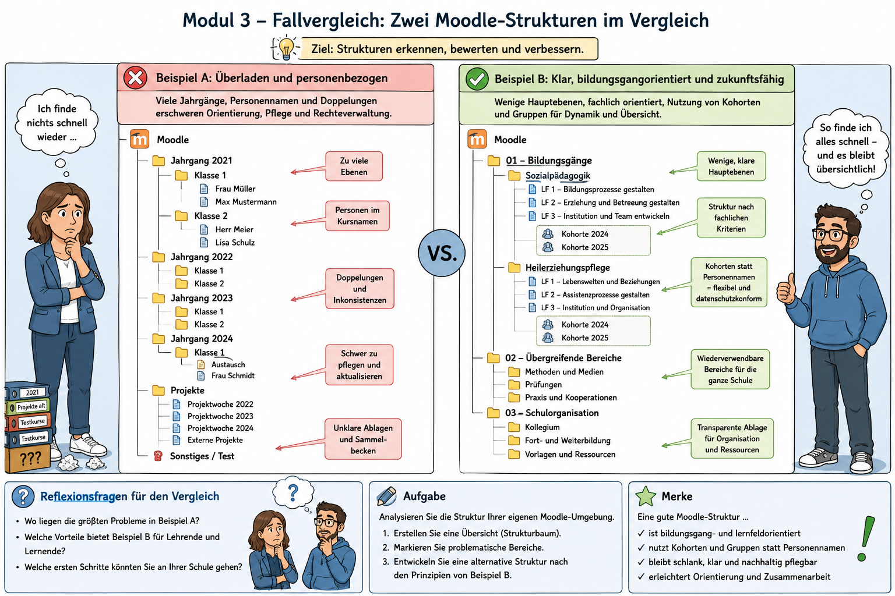
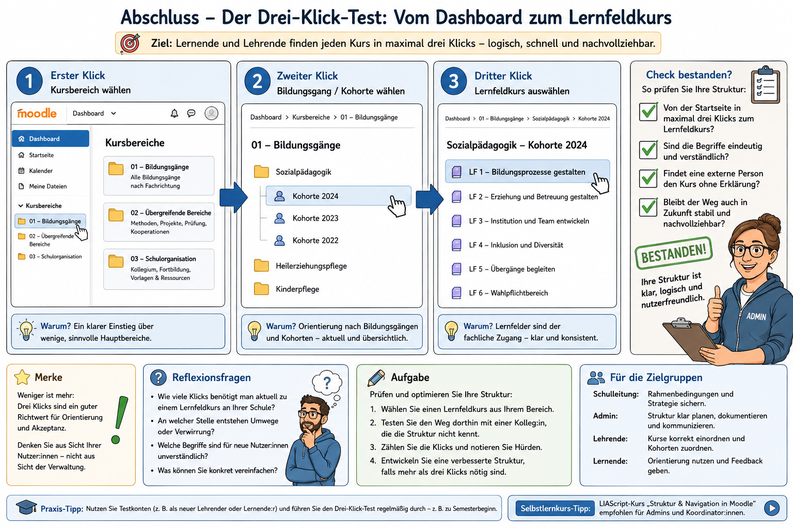

<!--
author: Stefan Hierholzer
email:
version: 1.0
language: de
narrator: German Male

comment: Selbstlernkurs Moodle Kursbereiche sauber planen.
         Für Schulleitungen, Bildungsgangleitungen und Moodle-Admins an Fachschulen für Sozialwesen,
         Berufsschulen und außerschulischen Bildungsorganisationen. DQR Niveau 6.

logo: moodle_kursbereiche.png

import: https://raw.githubusercontent.com/LiaScript/docs/master/README.md

link: https://fonts.googleapis.com/css2?family=Source+Sans+Pro:wght@300;400;600&display=swap
-->

# Moodle Kursbereiche sauber planen

> **Ein kompakter Selbstlernkurs für Schulleitung, Bildungsgangleitungen und Moodle-Admins nach der Architekturplanung**

---

## 📋 Kursübersicht

| Angabe | Information |
|--------|-------------|
| **Thema** | Moodle Kursbereiche sauber planen |
| **Anknüpfungspunkt** | Nach der Architekturplanung |
| **Zielgruppe** | Schulleitung, Bildungsgangleitungen, Admins |
| **Zeitaufwand** | ca. 30–45 Minuten |
| **Niveau** | DQR Stufe 6 |
| **Format** | Selbstlernkurs mit Analyseauftrag, Sortieraufgaben, Strukturdiagramm, Fallvergleich und Drei-Klick-Test |
| **Benötigtes Material** | Aktueller Moodle-Strukturplan, Bildungsgangübersicht, Beispielbaum |

---

## 🎯 Kompetenzorientierte Lernziele (DQR 6)

Nach Abschluss dieses Kurses sind Sie in der Lage:

**Wissen und Verstehen**

1. Kursbereiche, Kurse, Kohorten, Gruppen und Rollen funktional voneinander zu unterscheiden.
2. zu erklären, warum Kursbereiche eine institutionell stabile Ordnungsstruktur abbilden sollten und nicht primär wechselhafte Klassenzugehörigkeiten.

**Können – instrumentale und systemische Kompetenzen**

3. einen Moodle-Kursbereichsbaum auf Plausibilität, Skalierbarkeit und Pflegeaufwand zu prüfen.
4. einen tragfähigen Beispielbaum für Fachschule, Berufsschule oder Bildungsorganisation zu entwerfen.
5. mit dem Drei-Klick-Test zu prüfen, ob zentrale Kurse für Nutzer:innen auffindbar sind.

**Können – kommunikative und soziale Kompetenzen**

6. Strukturentscheidungen gegenüber Kollegium, Bildungsgangleitung und Administration fachlich begründen.

---

## ⏱️ Zeitplanung

```ascii
Modul 0: Einstieg und Problemklärung             5 min
Modul 1: Begriffe sauber trennen                10 min
Modul 2: Strukturprinzipien anwenden            10 min
Modul 3: Fallvergleich und Beispielbaum         10 min
Abschluss: Drei-Klick-Test und Transfer       5–10 min
────────────────────────────────────────────────────
Gesamt:                                  ca. 30–45 min
```

---

## Modul 0: Einstieg – Warum Kursbereiche keine Nebensache sind

### Ausgangspunkt

Nach der Architekturplanung liegt häufig ein erster Moodle-Strukturplan vor. Dieser Plan wirkt auf den ersten Blick technisch. Tatsächlich entscheidet er darüber, ob Moodle später als übersichtlicher Lern-, Arbeits- und Organisationsraum genutzt werden kann oder ob eine wachsende digitale Ablage entsteht.

Kursbereiche sind in Moodle die sichtbare Ordnungsebene für Kurse. Sie helfen Nutzer:innen, Kurse schneller zu finden. Sie sind zugleich ein administrativer Kontext: Rechte, Zuständigkeiten und Kohorten können auf dieser Ebene relevant werden.

> **📝 Merksatz**
>
> *Kursbereiche bilden die stabile Architektur der Organisation ab. Wechselhafte Zugehörigkeiten werden besser über Kohorten, Gruppen oder Einschreiberegeln gesteuert.*

---

> **💭 Reflexionsfrage 0.1 – Erste Bestandsaufnahme**
>
> Denken Sie an Ihre aktuelle Moodle-Instanz:
>
> - Finden Lehrkräfte ihre Kurse ohne Nachfragen?
> - Ist erkennbar, welcher Bereich für Bildungsgang, Kollegium, Verwaltung oder Archiv zuständig ist?
> - Gibt es Kursbereiche, die nur deshalb existieren, weil eine Klasse, ein Jahrgang oder eine einzelne Lehrkraft kurzfristig organisiert werden musste?
>
> Notieren Sie drei Stellen, an denen Ihre Struktur bereits stabil wirkt, und drei Stellen, an denen sie unnötig komplex geworden ist.

---

### ✅ Selbstüberprüfung Modul 0

Welche Aussage beschreibt die Funktion von Moodle-Kursbereichen am treffendsten?

- [( )] Kursbereiche ersetzen Kurse und enthalten direkt alle Materialien.
- [(X)] Kursbereiche ordnen Kurse in einer sichtbaren und administrativ nutzbaren Struktur.
- [( )] Kursbereiche sind ausschließlich für Prüfungen gedacht.
- [( )] Kursbereiche dienen nur der optischen Gestaltung der Moodle-Startseite.

---

## Modul 1: Begriffe sauber trennen



### 1.1 Die fünf zentralen Bausteine

| Baustein | Funktion | Typische Leitfrage |
|----------|----------|--------------------|
| **Kursbereich** | Ordnet Kurse hierarchisch und bildet eine stabile Struktur ab | Wo gehört dieser Kurs im System hin? |
| **Kurs** | Enthält Lernaktivitäten, Materialien, Kommunikation und ggf. Bewertungen | Woran arbeiten die Nutzer:innen konkret? |
| **Kohorte** | Bündelt Nutzer:innen standortweit oder kursbereichsbezogen | Welche Personen sollen gemeinsam in Kurse eingeschrieben werden? |
| **Gruppe** | Unterteilt Teilnehmende innerhalb eines Kurses | Welche Arbeitsgruppen brauchen getrennte Räume oder Ansichten? |
| **Rolle/Recht** | Regelt, was Nutzer:innen in einem Kontext dürfen | Wer darf hier was sehen, anlegen, ändern oder pflegen? |

> **📝 Merksatz**
>
> *Ein häufiger Strukturfehler entsteht, wenn Kursbereiche für Aufgaben genutzt werden, die eigentlich Kohorten, Gruppen oder Rollen leisten sollten.*

---

### 1.2 Sortieraufgabe: Was gehört wohin?

Ordnen Sie die folgenden Elemente dem passenden Moodle-Baustein zu.

| Element | Passender Baustein |
|---------|--------------------|
| Fachschule Sozialpädagogik | [[Kursbereich]] |
| Lernfeld 2: Pädagogische Beziehungen gestalten | [[Kurs]] |
| FS 24 A als feste Nutzer:innenliste | [[Kohorte]] |
| Kleingruppe „Beobachtung und Dokumentation“ innerhalb eines Kurses | [[Gruppe]] |
| Bildungsgangleitung darf Unterkurse anlegen | [[Rolle/Recht]] |
| Archiv 2025/2026 | [[Kursbereich]] |
| Praxisreflexion Gruppe 3 innerhalb eines Lernfeldkurses | [[Gruppe]] |
| Alle Studierenden des dritten Semesters | [[Kohorte]] |

---

### 1.3 Kurzdiagnose: Typische Verwechslungen

| Problematische Entscheidung | Warum sie riskant ist | Bessere Lösung |
|-----------------------------|-----------------------|----------------|
| Für jede Klasse wird ein eigener Kursbereich angelegt | Klassen wechseln, werden geteilt oder laufen aus; die Struktur wächst schnell unübersichtlich | Klasse als Kohorte führen; Kurse in stabile Bildungsgang- oder Lernfeldbereiche legen |
| Für jede Lehrkraft entsteht ein eigener Kursbereich | Die Organisation wird personenbezogen statt fachlich strukturiert | Kurse nach Bildungsgang, Lernfeld, Fach oder Prozess ordnen |
| Prüfungen, Projekte und Praxisaufgaben liegen in zufälligen Kursbereichen | Nutzer:innen finden relevante Kurse nur über direkte Links | Eigene stabile Prozessbereiche für Praxis, Prüfungen und Projekte definieren |
| Archivkurse bleiben zwischen aktiven Kursen liegen | Die aktive Arbeitsfläche wird überladen | Eigenen Archivbereich mit Jahreslogik nutzen |

---

### ✅ Selbstüberprüfung Modul 1

**Frage 1:** Was ist die beste Lösung, wenn eine Klasse in mehrere Moodle-Kurse eingeschrieben werden soll?

- [( )] Für die Klasse einen eigenen Hauptkursbereich anlegen.
- [(X)] Die Klasse als Kohorte führen und über Einschreiberegeln in passende Kurse bringen.
- [( )] Alle Schüler:innen einzeln in jeden Kurs eintragen und die Struktur unverändert lassen.
- [( )] Einen Kurs pro Schüler:in erstellen.

---

**Frage 2:** Welche Aussage ist fachlich tragfähig?

- [(X)] Kursbereiche sollten eher stabile Organisationslogiken als kurzfristige Zugehörigkeiten abbilden.
- [( )] Kursbereiche sollten immer nach einzelnen Lehrkräften benannt werden.
- [( )] Kohorten sind dasselbe wie Moodle-Gruppen.
- [( )] Rollen sind nur für Administrator:innen relevant.

---

## Modul 2: Strukturprinzipien anwenden



### 2.1 Vier Planungsprinzipien

Eine tragfähige Kursbereichsstruktur folgt vier Prinzipien:

1. **Stabilität:** Die obersten Ebenen ändern sich selten.
2. **Auffindbarkeit:** Zentrale Kurse sind ohne Spezialwissen erreichbar.
3. **Skalierbarkeit:** Neue Kurse können ergänzt werden, ohne den gesamten Baum neu zu ordnen.
4. **Zuständigkeit:** Es ist klar, wer welchen Bereich fachlich und technisch pflegt.

> **📝 Merksatz**
>
> *Eine gute Moodle-Struktur ist nicht maximal detailliert, sondern sinnvoll begrenzt. Zu viele Ebenen erzeugen Sucharbeit statt Orientierung.*

---

### 2.2 Strukturdiagramm: Beispielbaum

Das folgende Diagramm zeigt eine mögliche Grundstruktur. Sie ist bewusst nicht als starre Vorgabe gedacht, sondern als prüfbarer Beispielbaum.

```ascii
Moodle-Startseite
│
├── 01 Fachschule Sozialpädagogik
│   ├── Bildungsgangorganisation
│   ├── Lernfelder
│   │   ├── LF 1 Berufliche Identität
│   │   ├── LF 2 Pädagogische Beziehungen
│   │   ├── LF 3 Lebenswelten und Inklusion
│   │   ├── LF 4 Bildungsarbeit
│   │   ├── LF 5 Partnerschaften und Übergänge
│   │   └── LF 6 Institution und Team
│   ├── Praxis
│   ├── Prüfungen und Projekte
│   └── Archiv
│
├── 02 Berufsschule / weitere Bildungsgänge
│   ├── Bildungsgang A
│   ├── Bildungsgang B
│   └── Archiv
│
├── 03 Kollegium
│   ├── Digitales Lehrerzimmer
│   ├── Fachgruppen
│   ├── Fortbildung und Selbstlernkurse
│   └── Vorlagen und Qualitätssicherung
│
└── 04 Verwaltung und Organisation
    ├── Formulare
    ├── Konferenzen
    ├── Dienstliche Informationen
    └── Prozessdokumentation
```

---

### 2.3 Prüfauftrag: Ist der Baum belastbar?

Prüfen Sie den Beispielbaum anhand der folgenden Kriterien.

| Prüffrage | Einschätzung |
|-----------|--------------|
| Bleiben die oberen Ebenen mindestens drei Jahre stabil? | [[Ja]] |
| Sind Klassen primär als Kursbereiche abgebildet? | [[Nein]] |
| Gibt es einen klaren Ort für Archivkurse? | [[Ja]] |
| Gibt es eigene Bereiche für Kollegium und Verwaltung? | [[Ja]] |
| Kann ein neuer Lernfeldkurs ergänzt werden, ohne die Hauptstruktur zu verändern? | [[Ja]] |

---

### 2.4 Arbeitsauftrag: Eigene Struktur skizzieren

Erstellen Sie nun eine erste Skizze für Ihre Schule oder Bildungsorganisation.

**Vorgehen:**

1. Legen Sie höchstens vier Hauptbereiche fest.
2. Prüfen Sie, ob jeder Hauptbereich eine stabile Organisationslogik abbildet.
3. Ordnen Sie Kurse nicht nach einzelnen Personen, sondern nach Bildungsgang, Lernfeld, Fach, Prozess oder Funktion.
4. Markieren Sie alle Elemente, die eigentlich Kohorten oder Gruppen sind.
5. Benennen Sie für jeden Hauptbereich eine fachliche Zuständigkeit.

> **💭 Reflexionsfrage 2.1 – Führungsentscheidung**
>
> Welche Hauptbereiche sind in Ihrer Organisation wirklich stabil?
> Welche Bereiche wirken nur deshalb wichtig, weil sie aktuell viel Aufmerksamkeit benötigen?

---

### ✅ Selbstüberprüfung Modul 2

Welche Strukturentscheidung ist am besten begründet?

- [( )] Jede Klasse bekommt dauerhaft einen eigenen Hauptkursbereich.
- [( )] Jede Lehrkraft pflegt einen eigenen Kursbereich mit allen Materialien.
- [(X)] Hauptbereiche orientieren sich an stabilen Bildungsgängen, Lernfeldern, Prozessen und Organisationsfunktionen.
- [( )] Alle Kurse liegen in einem einzigen Bereich, damit niemand suchen muss.

---

## Modul 3: Fallvergleich – Zwei Schulen, zwei Strukturlogiken



### 3.1 Fall A: Die gewachsene Struktur

Eine Fachschule nutzt Moodle seit mehreren Jahren. Kursbereiche wurden immer dann angelegt, wenn ein neuer Bedarf entstand. Es gibt Bereiche wie:

- Klasse FS 22 A
- Klasse FS 23 B
- Frau M. Materialien
- Prüfungen alt
- Praxis 2024 neu
- Lernfeldkurse
- Sonstiges
- Testkurse
- Archiv alt alt

**Analyse:**  
Diese Struktur ist zwar aus dem Alltag heraus verständlich, erzeugt aber langfristig mehrere Risiken: unklare Zuständigkeiten, doppelte Kursanlagen, schwer auffindbare Materialien und fehlende Trennung zwischen aktiven und abgeschlossenen Kursen.

---

### 3.2 Fall B: Die geplante Struktur

Eine andere Fachschule trennt die Ebenen konsequent:

- Kursbereiche bilden Bildungsgänge, Lernfelder, Praxis, Prüfungen, Kollegium und Verwaltung ab.
- Klassen werden als Kohorten geführt.
- Arbeitsgruppen innerhalb eines Kurses werden als Gruppen angelegt.
- Archivkurse liegen in einem eigenen Archivbereich mit Schuljahreskennung.
- Zuständigkeiten sind pro Hauptbereich dokumentiert.

**Analyse:**  
Diese Struktur bleibt auch dann tragfähig, wenn Klassen wechseln, neue Kurse entstehen oder Lehrkräfte Aufgaben abgeben. Sie reduziert Suchaufwand und erleichtert Administration.

---

### 3.3 Interaktiver Fallvergleich

Welche Bewertung passt zu welchem Fall?

| Aussage | Fall |
|---------|------|
| Die Struktur ist stark von kurzfristigen Bedarfen geprägt. | [[Fall A]] |
| Wechselhafte Zugehörigkeiten werden nicht mit Kursbereichen verwechselt. | [[Fall B]] |
| Die Auffindbarkeit hängt stark von Insiderwissen ab. | [[Fall A]] |
| Archivierung ist als eigener Prozess sichtbar. | [[Fall B]] |
| Die Struktur ist bei Personalwechsel besonders anfällig. | [[Fall A]] |
| Die Struktur kann wachsen, ohne sofort unübersichtlich zu werden. | [[Fall B]] |

---

### 3.4 Entscheidungssituation

Sie übernehmen die Administration einer Moodle-Instanz mit 480 aktiven Nutzer:innen, sechs Bildungsgängen, mehreren Praxisphasen und einem stark wachsenden Kollegiumsbereich. Die vorhandene Struktur enthält 68 Kursbereiche, davon viele mit Klassennamen und Personennamen.

Welche erste Entscheidung ist fachlich am sinnvollsten?

- [( )] Alle Kursbereiche sofort löschen und neu beginnen.
- [( )] Weitere Unterbereiche anlegen, damit jeder alte Bereich genauer beschrieben ist.
- [(X)] Zuerst eine Zielstruktur festlegen, dann aktive Kurse, Archivkurse, Kohorten und Zuständigkeiten systematisch zuordnen.
- [( )] Alle Nutzer:innen auffordern, künftig nur noch die Suchfunktion zu verwenden.

---

## Abschluss: Drei-Klick-Test und Transfer



### 4.1 Der Drei-Klick-Test

Der Drei-Klick-Test prüft die Alltagstauglichkeit Ihrer Kursbereichsstruktur. Er ist kein technisches Gesetz, sondern ein praxologischer Qualitätsindikator.

**Aufgabe:** Wählen Sie drei zentrale Zielkurse aus Ihrer Moodle-Instanz aus:

1. einen Lernfeld- oder Fachkurs,
2. einen Organisationskurs für das Kollegium,
3. einen Praxis- oder Prüfungskurs.

Dokumentieren Sie den Weg von der Moodle-Startseite bis zum Zielkurs.

| Zielkurs | Klick 1 | Klick 2 | Klick 3 | Ergebnis |
|----------|---------|---------|---------|----------|
| Lernfeld-/Fachkurs | ... | ... | ... | [[auffindbar / prüfen]] |
| Kollegiumskurs | ... | ... | ... | [[auffindbar / prüfen]] |
| Praxis-/Prüfungskurs | ... | ... | ... | [[auffindbar / prüfen]] |

---

### 4.2 Auswertung

Bewerten Sie Ihre Struktur anhand dieser Skala:

| Ergebnis | Bedeutung | Konsequenz |
|----------|-----------|------------|
| Alle drei Zielkurse sind in maximal drei Klicks erreichbar | Struktur ist alltagstauglich | Beibehalten und dokumentieren |
| Ein Zielkurs braucht mehr als drei Klicks | Struktur ist teilweise zu tief | Benennung, Ebene oder Zuordnung prüfen |
| Nutzer:innen brauchen direkte Links, weil sie Kurse sonst nicht finden | Struktur trägt nicht ausreichend | Kursbereichsbaum grundlegend überarbeiten |
| Aktive und archivierte Kurse liegen nebeneinander | Suchaufwand steigt | Archivbereich und Jahreslogik einführen |

---

> **💭 Abschlussreflexion – Transfer in die eigene Rolle**
>
> Welche eine Strukturentscheidung sollte in Ihrer Schule als Nächstes getroffen werden?
>
> Formulieren Sie die Entscheidung in einem Satz:
>
> **„Wir ordnen Moodle-Kursbereiche künftig primär nach ... und steuern wechselhafte Zugehörigkeiten über ...“**

---

### ✅ Abschlusstest

**Frage 1:** Was ist das wichtigste Kriterium für die obersten Kursbereiche?

- [( )] Sie müssen möglichst viele Details enthalten.
- [(X)] Sie sollten eine stabile Organisationslogik abbilden.
- [( )] Sie sollten nach den Namen der aktivsten Lehrkräfte sortiert sein.
- [( )] Sie sollten jedes Schuljahr vollständig neu angelegt werden.

---

**Frage 2:** Welche Elemente sollten nicht ohne fachliche Begründung als Hauptkursbereiche geführt werden? Mehrfachauswahl möglich.

- [[X]] einzelne Klassen
- [[X]] einzelne Lehrkräfte
- [[ ]] Bildungsgänge
- [[ ]] Kollegiumsbereich
- [[X]] kurzfristige Projektgruppen
- [[ ]] Archivbereich

---

**Frage 3:** Ergänzen Sie die zentrale Unterscheidung.

Kursbereiche bilden die [[stabile]] Struktur der Organisation ab. Wechselhafte Zugehörigkeiten werden besser über [[Kohorten]], [[Gruppen]] oder passende Einschreiberegeln gesteuert.

---

## 📌 Ergebnisprodukt

Am Ende dieses Selbstlernkurses sollten Sie drei Arbeitsergebnisse vorliegen haben:

1. eine markierte Liste problematischer Kursbereiche,
2. eine erste Zielstruktur mit höchstens vier Hauptbereichen,
3. eine Drei-Klick-Prüfung für drei zentrale Zielkurse.

Diese Ergebnisse können direkt in die weitere Moodle-Planung, in eine Admin-Besprechung oder in eine Sitzung der Bildungsgangleitung eingebracht werden.

---

## 📚 Weiterführende Ressourcen

- MoodleDocs. (2025). *Course categories*. https://docs.moodle.org/en/Course_categories
- MoodleDocs. (2025). *Cohorts*. https://docs.moodle.org/en/Cohorts
- MoodleDocs. (2026). *Adding a new course*. https://docs.moodle.org/en/Adding_a_new_course
- MoodleDocs. (2012). *Capabilities/moodle/category:manage*. https://docs.moodle.org/en/Capabilities/moodle/category%3Amanage

---
